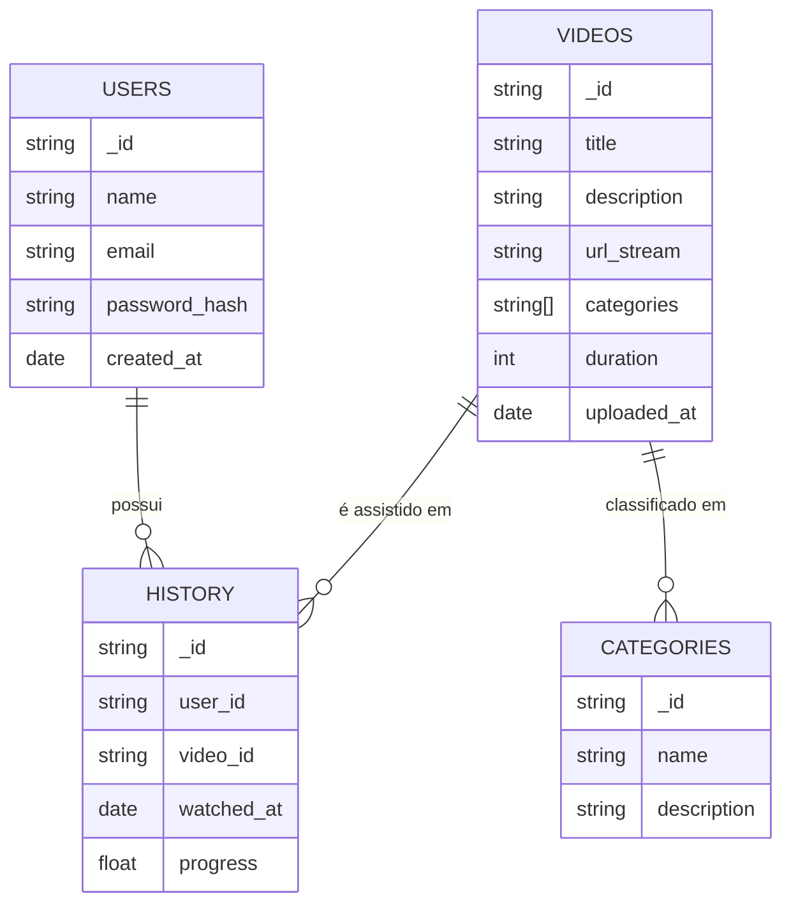

# Atividades de Modelagem de Banco de Dados NoSQL

Este repositório contém a entrega das duas atividades propostas sobre modelagem de banco de dados **NoSQL**.  
Cada atividade apresenta um cenário distinto, com justificativas, esquemas de coleções e diagramas.

---

## 📌 Atividade 1 - Esquema de Banco de Dados NoSQL para Aplicação de Consumo de Vídeos Online

### 1. Tipo de Banco de Dados NoSQL Recomendado
O tipo de banco de dados **NoSQL orientado a documentos (MongoDB)** é o mais recomendado para este cenário.  

**Motivos:**
- Flexibilidade de schema para armazenar metadados dos vídeos.  
- Suporte a alto volume de dados e escalabilidade horizontal.  
- Estrutura simples para coleções de **usuários, vídeos, categorias e histórico de consumo**.  
- Boa integração com APIs e microsserviços.  

---

### 2. Estrutura das Coleções (MongoDB)

#### **Coleção: users**
```json
{
  "_id": "u123",
  "name": "Alexandre Tessaro",
  "email": "alexandre@email.com",
  "password_hash": "****",
  "created_at": "2025-08-24T20:00:00Z"
}
```

#### **Coleção: videos**
```json
{
  "_id": "v987",
  "title": "Introdução ao NoSQL",
  "description": "Aula sobre bancos não relacionais",
  "url_stream": "https://cdn.app/videos/v987.m3u8",
  "categories": ["Educação", "Tecnologia"],
  "duration": 3600,
  "uploaded_at": "2025-08-20T15:00:00Z"
}
```

#### **Coleção: categories**
```json
{
  "_id": "c10",
  "name": "Tecnologia",
  "description": "Vídeos relacionados a TI e inovação"
}
```

#### **Coleção: history**
```json
{
  "_id": "h555",
  "user_id": "u123",
  "video_id": "v987",
  "watched_at": "2025-08-23T21:00:00Z",
  "progress": 0.75
}
```

---

### 3. Modelo Relacional (NoSQL)

#### Representação Textual
```
[Users] --------< [History] >-------- [Videos] --------< [Categories]
```

- **Users** (1:N) **History**  
- **Videos** (1:N) **History**  
- **Videos** (N:N) **Categories**  

#### Representação em Mermaid


---

### 4. Justificativa
- O **MongoDB** foi escolhido por sua flexibilidade e suporte a grandes volumes de dados multimídia.  
- O **histórico** é separado em uma coleção própria para garantir escalabilidade e auditoria.  
- A relação **N:N entre vídeos e categorias** é facilmente representada por arrays ou referências.  

---

## 📌 Atividade 1 - MongoDB com Dataset Netflix

## 🎯 Objetivo
O objetivo desta atividade é trabalhar com o banco de dados **MongoDB** utilizando um dataset real (Netflix) para explorar consultas básicas e compreender melhor como funciona o modelo **NoSQL – Documento**.

---

## 📂 Dataset Utilizado
Arquivo importado: `netflix_titles.csv`

Local do arquivo no computador:  
`C:\Users\alexa\OneDrive\Área de Trabalho\N1-PredictiveAnalysis\netflix_titles.csv`

### Estrutura do CSV
Exemplo de colunas do dataset:
- `show_id`
- `type`
- `title`
- `director`
- `cast`
- `country`
- `date_added`
- `release_year`
- `rating`
- `duration`
- `listed_in`
- `description`

---

## ⚙️ Passos Executados

1. Criado cluster no **MongoDB Atlas** (banco online).
2. Importado o arquivo CSV utilizando o comando:

   ```bash
   mongoimport --uri "<STRING_DE_CONEXÃO>"      --collection filmes      --type csv      --headerline      --file "C:\Users\alexa\OneDrive\Área de Trabalho\N1-PredictiveAnalysis\netflix_titles.csv"
   ```

3. Verificação da importação no banco:

   ```js
   db.filmes.countDocuments()
   ```

---

## 🔍 Exemplos de Consultas Realizadas

### 1. Buscar todos os filmes adicionados em 2021
```js
db.filmes.find({ release_year: 2021 })
```

### 2. Buscar apenas documentários
```js
db.filmes.find({ listed_in: /Documentaries/ })
```

### 3. Buscar filmes ou séries do **Brasil**
```js
db.filmes.find({ country: "Brazil" })
```

### 4. Buscar títulos com classificação **TV-MA**
```js
db.filmes.find({ rating: "TV-MA" })
```

### 5. Contar quantos filmes existem no dataset
```js
db.filmes.countDocuments({ type: "Movie" })
```

---

## 📸 Evidências
👉 Cole aqui os **prints das consultas realizadas** no MongoDB Compass ou Shell.

---

## 📌 Conclusão
- Foi possível importar o dataset Netflix para o MongoDB Atlas com sucesso.  
- Foram executadas consultas básicas para explorar os dados.  
- A atividade demonstrou como o MongoDB é flexível ao lidar com dados semi-estruturados.  
