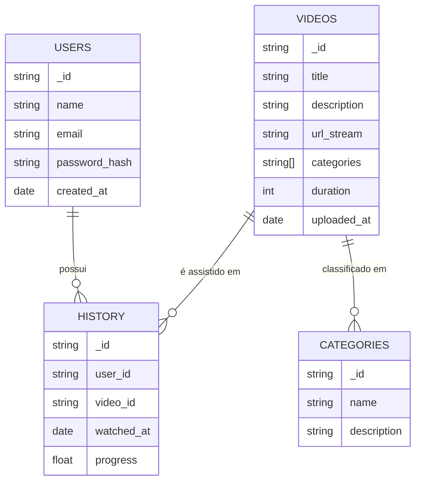

# Esquema de Banco de Dados NoSQL para Aplicação de Consumo de Vídeos Online

## 1. Tipo de Banco de Dados NoSQL Recomendado
O tipo de banco de dados **NoSQL orientado a documentos (MongoDB)** é o mais recomendado para este cenário.  

**Motivos:**
- Flexibilidade de schema para armazenar metadados dos vídeos.  
- Suporte a alto volume de dados e escalabilidade horizontal.  
- Estrutura simples para coleções de **usuários, vídeos, categorias e histórico de consumo**.  
- Boa integração com APIs e microsserviços.  

---

## 2. Estrutura das Coleções (MongoDB)

### **Coleção: users**
```json
{
  "_id": "u123",
  "name": "Alexandre Tessaro",
  "email": "alexandre@email.com",
  "password_hash": "****",
  "created_at": "2025-08-24T20:00:00Z"
}
```

### **Coleção: videos**
```json
{
  "_id": "v987",
  "title": "Introdução ao NoSQL",
  "description": "Aula sobre bancos não relacionais",
  "url_stream": "https://cdn.app/videos/v987.m3u8",
  "categories": ["Educação", "Tecnologia"],
  "duration": 3600,
  "uploaded_at": "2025-08-20T15:00:00Z"
}
```

### **Coleção: categories**
```json
{
  "_id": "c10",
  "name": "Tecnologia",
  "description": "Vídeos relacionados a TI e inovação"
}
```

### **Coleção: history**
```json
{
  "_id": "h555",
  "user_id": "u123",
  "video_id": "v987",
  "watched_at": "2025-08-23T21:00:00Z",
  "progress": 0.75
}
```

---

## 3. Modelo Relacional (NoSQL)

### Representação Textual
```
[Users] --------< [History] >-------- [Videos] --------< [Categories]
```

- **Users** (1:N) **History**  
- **Videos** (1:N) **History**  
- **Videos** (N:N) **Categories**  

### Representação em Mermaid


---

## 4. Justificativa
- O **MongoDB** foi escolhido por sua flexibilidade e suporte a grandes volumes de dados multimídia.  
- O **histórico** é separado em uma coleção própria para garantir escalabilidade e auditoria.  
- A relação **N:N entre vídeos e categorias** é facilmente representada por arrays ou referências.  
